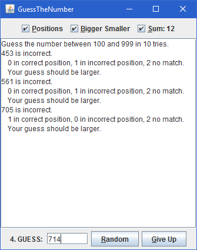
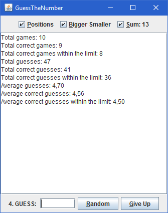

# Guess the Number

Try to find the number using various hints.

 

## Gameplay & Features

* Enter your guess by using various hints.
  * sum of all digits in the actual number.
  * number of digits
    * in correct and incorrect positions relative to the actual number.
    * do not exist in actual number.
  * whether your guess is bigger or smaller than the actual number.
* Also randomly guess a number or give up.
* Choose whether to continue to round or give up when you reach the limit.
* Viewing detailed statistics about total number of guesses at the end.
* Digits cannot repeat.

There are some customization options for adding variety.
You can set these options using _GuessTheNumberConfiguration.ini_ file after building
(Hard-coding options into code is not necessary).
This file is read before every round so you can play each round with different options.

## Customizations

* Specify a lower and an upper limit for the number.
* Set a limit for your guesses.